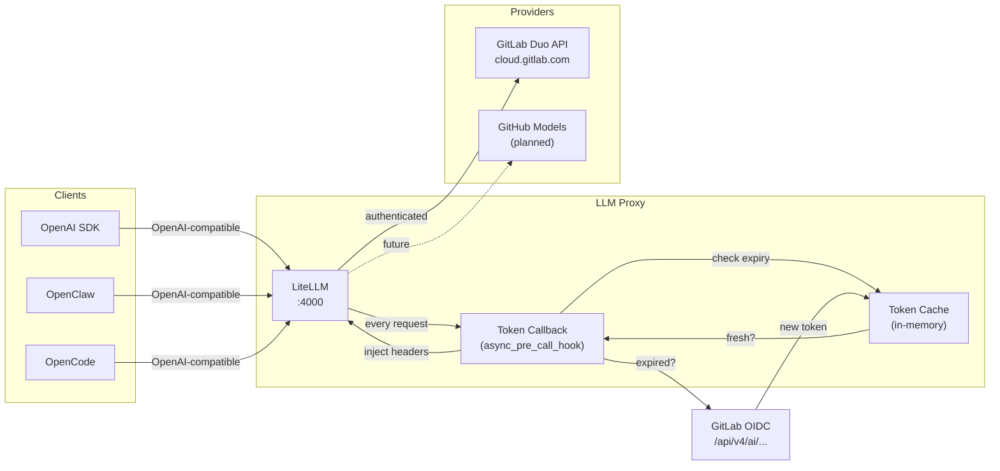
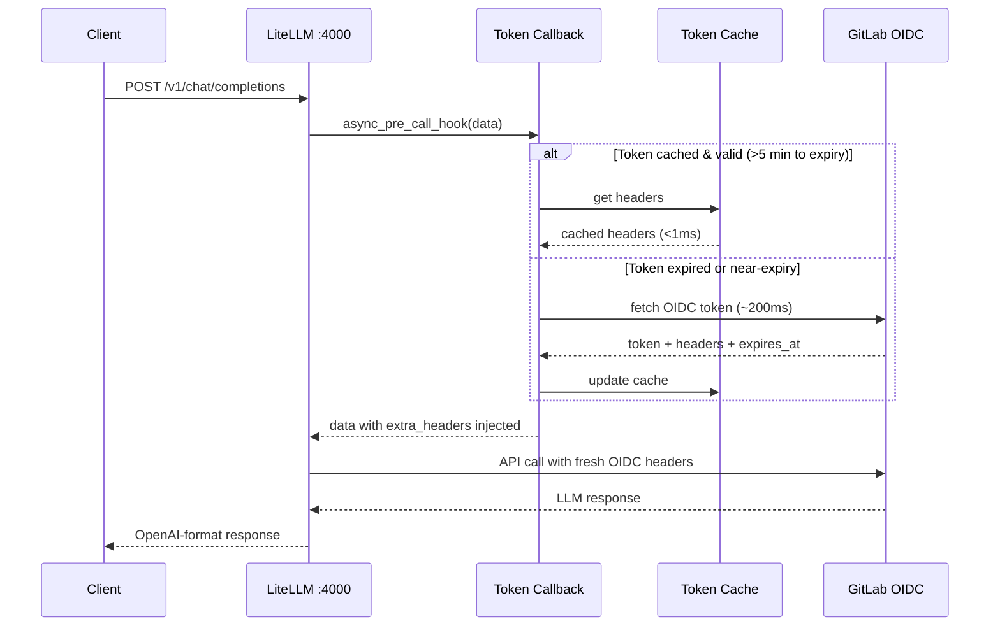

# LLM Proxy

LiteLLM-based proxy that routes OpenAI-compatible requests to GitLab Duo (and soon GitHub Models). Handles OIDC token refresh inline — no cron jobs, no restarts.

## How it works





The callback (`gitlab_token_callback.py`) uses LiteLLM's `CustomLogger.async_pre_call_hook` to:
- Cache OIDC tokens in memory
- Refresh 5 minutes before expiry (single-flight via `asyncio.Lock`)
- Fall back to last-known-good token if refresh fails

Zero restarts. Zero cron jobs. Token stays fresh forever.

## Setup

### Prerequisites

- Python 3.10+
- [LiteLLM](https://github.com/BerriAI/litellm): `pip install litellm`
- [PM2](https://pm2.keymetrics.io/): `npm install -g pm2`

### 1. Clone and configure

```bash
git clone git@github.com:nano-step/llm-proxy.git
cd llm-proxy

cp .env.example .env
# Edit .env with your values:
#   GITLAB_PAT=glpat-your-token-here
#   LITELLM_MASTER_KEY=your-api-key
#   LITELLM_PORT=4000
```

### 2. Configure models

Edit `litellm_config.yaml` to add/remove models. Each model needs:
- `model_name`: what clients use (e.g., `gitlab/claude-sonnet-4-6`)
- `model`: upstream provider model ID
- `api_base`: provider endpoint
- `api_key`: set to `gitlab-oidc` (actual auth handled by callback)

### 3. Start

```bash
pm2 start ecosystem.config.cjs
pm2 save
```

### 4. Test

```bash
curl http://localhost:4000/v1/chat/completions \
  -H "Authorization: Bearer $LITELLM_MASTER_KEY" \
  -H "Content-Type: application/json" \
  -d '{"model": "gitlab/claude-haiku-4-5", "messages": [{"role": "user", "content": "Hello"}]}'
```

## Files

| File | Purpose |
|---|---|
| `gitlab_token_callback.py` | OIDC token manager + LiteLLM callback |
| `litellm_config.yaml` | Model definitions and callback registration |
| `ecosystem.config.cjs` | PM2 process config (reads `.env`) |
| `.env` | Secrets (gitignored) |
| `proxy.py` | Legacy wrapper (kept for reference) |
| `token_db.py` / `token_logger.py` | Token usage logging to SQLite |

## Environment variables

| Variable | Required | Description |
|---|---|---|
| `GITLAB_PAT` | Yes | GitLab Personal Access Token with Duo access |
| `LITELLM_MASTER_KEY` | Yes | API key clients use to authenticate to the proxy |
| `LITELLM_PORT` | No | Proxy port (default: 4000) |
| `GITLAB_INSTANCE` | No | GitLab instance URL (default: https://gitlab.com) |
